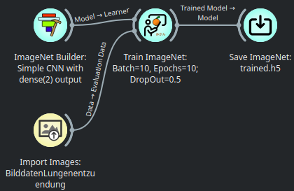
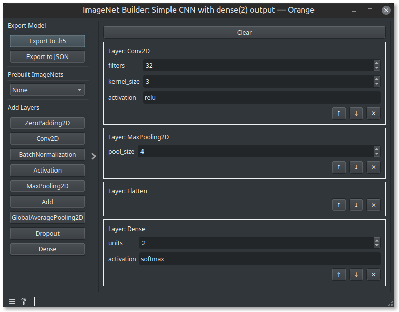
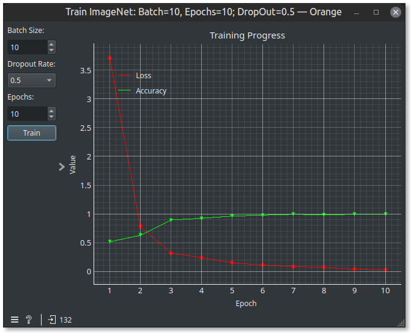
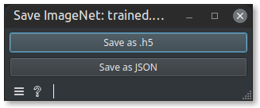
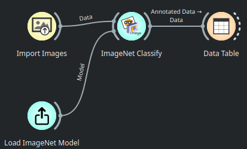
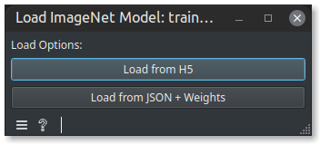
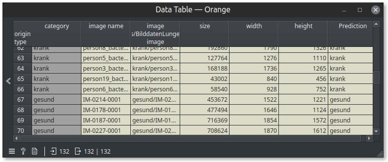

# orange3-imagenets

This provides a collection of widgets for training and applying neural networks to images.

## Installation

Within the Add-ons installer, click on "Add more..." and type in orange3-imagenets

## Widgets

### ImageNet Builder

You can build a Keras model by adding layers and moving them around.

### Using the ImageNet

Load the image net from a saved file.

